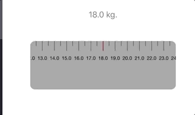

# scrollruler

[](https://cocoapods.org/pods/scrollruler)
[](https://cocoapods.org/pods/scrollruler)
[](https://cocoapods.org/pods/scrollruler)




To run the example project, clone the repo, and run `pod install` from the Example directory first.

## Requirements
* iOS 9 or higher

## Installation

scrollruler is available through [CocoaPods](https://cocoapods.org). To install
it, simply add the following line to your Podfile:

```ruby
pod 'MLscrollruler'
```

## How to use
```swift
import MLscrollruler
```

```swift
class ViewController:UIViewController,RulerDelegate{

}
```
```swift
func setupRuler(ruler: ScrollFrame, figure: Double) {
//you can get value when you scrolling
print("\(figure)")
}
```
```swift
func setup(){
//customize frame x, y and width
let centerX = view.frame.width / 2
let ruler = ScrollFrame(frame: CGRect(x: (centerX - 150), y: 120, width: 300, height: 100))
ruler.delegate = self
//customize 
ruler.scrollView.backgroundColor = .lightGray
ruler.middleLine.backgroundColor = .red
ruler.rulerLine.strokeColor = UIColor.black.cgColor
view.addSubview(ruler)
}
```
```swift
override func viewDidLoad() {
super.viewDidLoad()
setup()
}
```


## Author

morrislwt, morris.lwt@gmail.com

## License

scrollruler is available under the MIT license. See the LICENSE file for more info.
